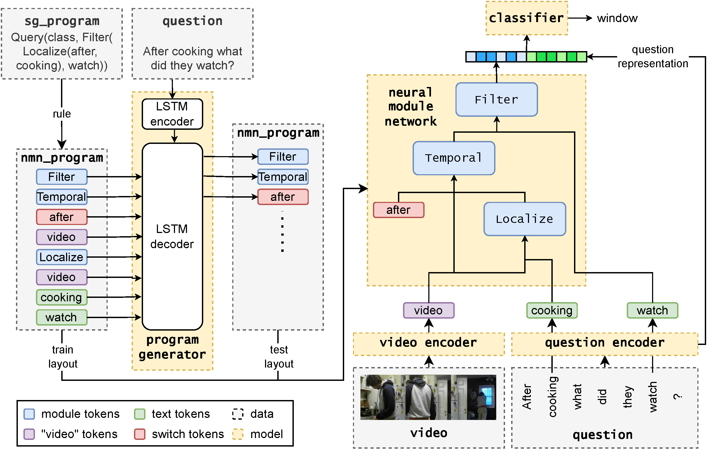

# STAIR: Spatial-Temporal Reasoning with Auditable Intermediate Results for Video Question Answering
This repositary provides all codes and resources needed to reproduce STAIR on the AGQA2.

STAIR is an Neural Module Network (NMN) for Video Question Answering.



## Preparing Data
### Download the Data
<!-- 1. Download AGQA data from [AGQA homepage](https://cs.stanford.edu/people/ranjaykrishna/agqa/). We need to download: ["Balanced AGQA" of AGQA benchmark](https://drive.google.com/uc?export=download&id=1cpw7L59VYD1YoycaQugWAAqH_nRlliDl), ["Balanced AGQA" of AGQA 2.0 benchmark](https://agqa-decomp.cs.washington.edu/data/agqa2/AGQA_balanced.zip), [Scene graphs of the videos](https://drive.google.com/uc?export=download&id=1CXU0tWpv-1kkkwkNzpU-BwQoAazPR1kR), and [README and supporting data](https://drive.google.com/drive/folders/1OMqA90VXY3BQorKFK5xWLSEEkqX31ui-?usp=sharing). -->

1. Download [README and supporting data](https://drive.google.com/drive/folders/1OMqA90VXY3BQorKFK5xWLSEEkqX31ui-?) from AGQA [AGQA homepage](https://cs.stanford.edu/people/ranjaykrishna/agqa/).

    We only need to download `tgif-qa_frameqa_appearance_feat.h5.zip` and `tgif-qa_frameqa_motion_feat.h5.zip` in `Video Feature` folder. Unzip them into folder `data/AGQA/video_features`.

    unzip `AGQA_scene_graphs.zip` into folder `data/AGQA/AGQA_scene_graphs`.

2. Download ["Balanced AGQA" of AGQA benchmark](https://drive.google.com/uc?export=download&id=1cpw7L59VYD1YoycaQugWAAqH_nRlliDl) from [AGQA homepage](https://cs.stanford.edu/people/ranjaykrishna/agqa/), and [CSV formatted questions](https://drive.google.com/file/d/1h9TETbtwYeyzHaQOamBbcZfS4nupdkmc/view?usp=sharing). Save the files in `data/AGQA/AGQA_balanced`.

    Download ["Balanced AGQA" of AGQA 2.0 benchmark](https://agqa-decomp.cs.washington.edu/data/agqa2/AGQA_balanced.zip) and [CSV formatted questions](https://agqa-decomp.cs.washington.edu/data/agqa2/csvs.zip) from [AGQA homepage](https://cs.stanford.edu/people/ranjaykrishna/agqa/). Save the files in `data/AGQA/AGQA2_balanced`.

    (Optional) If you want to use STAIR with Video-ChatGPT, or other video-text LLMs that uses raw video as input, you also need to download the [videos of Charades](https://ai2-public-datasets.s3-us-west-2.amazonaws.com/charades/Charades_v1_480.zip) and save the vides in `data/AGQA/videos`

<!-- 3. Download RX (resnet rgb + resnext flow) features from [Charades homepage]. We need to download: [Two-Stream features at 8fps \(RGB Stream\)](https://ai2-public-datasets.s3-us-west-2.amazonaws.com/charades/Charades_v1_features_rgb.tar.gz) and [Two-Stream features at 8fps \(Flow Stream\)](https://ai2-public-datasets.s3-us-west-2.amazonaws.com/charades/Charades_v1_features_flow.tar.gz). -->

3. Download glove.6B from [GloVe homepage](https://nlp.stanford.edu/projects/glove/), unzip and move the `glove.6B.300d.txt` file to `./data/glove.6B.300d.txt`.

3. (Optional) If you want to use our extracted I3D features, you can downloaded them from [Google Drive](https://drive.google.com/drive/folders/18DAXKKGckdgmIDrvJC5nYFn4tBPaWKyo?usp=sharing), and unzip them to `data/AGQA/video_features/i3d_rgb` and `data/AGQA/video_features/i3d_flow`.

4. (Optional) If you want to use STAIR with Video-ChatGPT, or other video-text LLMs that uses raw video as input, you also need to download the [videos of Charades](https://ai2-public-datasets.s3-us-west-2.amazonaws.com/charades/Charades_v1_480.zip)

### Preprocess the Data

We provide pre-processed pickle files at [Google Drive](https://drive.google.com/drive/folders/18DAXKKGckdgmIDrvJC5nYFn4tBPaWKyo?usp=sharing), and you can also preprocess the data by yourself using the following command:

```shell
dataset=AGQA2
python -u ./utils/agqa_lite.py --func convert \
    --id2word-filename data/AGQA/AGQA_scene_graphs/ENG.txt \
    --word2id-filename data/AGQA/AGQA_scene_graphs/IDX.txt \
    --train-sg-filename data/AGQA/AGQA_scene_graphs/AGQA_train_stsgs.pkl \
    --test-sg-filename data/AGQA/AGQA_scene_graphs/AGQA_test_stsgs.pkl \
    --train-csv-filename data/AGQA/${dataset}_balanced/Train_frameqa_question-balanced.csv \
    --test-csv-filename data/AGQA/${dataset}_balanced/Test_frameqa_question-balanced.csv \
    --input-folder data/AGQA/${dataset}_balanced \
    --output-folder data/AGQA/${dataset}_balanced_pkls

```
This program will read QAs, program annotations (sg_program) and video scene graphs, convert them into NMN layouts (nmn_program) and intermediate supervision ground truths, and save them in one pickle file per train/valid/test set.

**Note:** This code runs correctly on AGQA2. But for AGQA1, we found some program annotations are wrongly annotated, and the code to fix them is so complicated that I couldn’t even read how does it work myself. We leave relasing the preprocessing code for AGQA1 as future work. However, if you are really interested in reproducing the results of AGQA1, you can use the downloaded pickle files, and save them at `data/AGQA/AGQA_balanced_pkls`.

After downloading all resoures (or preprocessing the pkl files by yourself), your `data` folder should look like this:
```
├── AGQA/
    └── videos/
        └── 001YG.mp4
        └── ...
    └── video_features/
        └── i3d_rgb/
        └── i3d_flow/
        └── tgif-qa_frameqa_appearance_feat.h5
        └── tgif-qa_frameqa_motion_feat.h5
    └── AGQA_balanced/
    └── AGQA2_balanced/
    └── AGQA_scene_graphs/
        └── AGQA_train_stsgs.pkl
        └── AGQA_test_stsgs.pkl
        └── ENG.txt
        └── IDX.txt
    └── AGQA_balanced_pkls/
        └── train_balanced.pkl
        └── valid_balanced.pkl
        └── test_balanced.pkl
    └── AGQA2_balanced_pkls/
        └── train_balanced.pkl
        └── valid_balanced.pkl
        └── test_balanced.pkl
    └── vocab.json
    └── filter_answers.json
├── glove.6B.300d.txt
```

## Program Parser
We release the code of using LSTM or Flan-T5-Large as program parser.

### Training and Inference of LSTM as Program Parser
If the program parser is only used to inference on AGQA and not on other datasets (i.e., don't need to generalize to questions with words unseen in the train set), a simple LSTM model is sufficient. Programs in `test_balanced-generated_program.pkl` we provided is generated by this LSTM program parser.

We take training and inference on AGQA2 as example:
```shell
# create fairseq format input
mkdir data/AGQA/AGQA2_fairseq
for split in train valid test; do
    python utils/get_fairseq_data_from_pkl.py 
        data/AGQA/AGQA2_balanced_pkls/${split}_balanced.pkl data/AGQA/AGQA2_fairseq/${split}.ques ./data/AGQA/AGQA2_fairseq/${split}.prog
done

fairseq-preprocess \
  --trainpref data/AGQA/AGQA2_fairseq/train --validpref data/AGQA/AGQA2_fairseq/valid --testpref data/AGQA/AGQA2_fairseq/test \
  --source-lang ques --target-lang prog \
  --destdir data/AGQA/AGQA2_fairseq/data-bin/AGQA2 --dataset-impl raw \
  --workers 16

# training
arch=lstm
pg_output_path=./snap/lstm-program_parser
mkdir -vp ${pg_output_path}
fairseq-train data/AGQA/AGQA2_fairseq/data-bin/AGQA2 --arch lstm \
    --encoder-layers 2 --decoder-layers 2 \
    --optimizer adam --lr 5e-4 --adam-betas '(0.9, 0.98)' --clip-norm 0.0 --dropout 0.2 --batch-size 64 --max-epoch 50 --patience 10 \
    --no-progress-bar --save-dir ${pg_output_path} --tensorboard-logdir ${pg_output_path}/runs --log-file ${pg_output_path}/log.log \
    --validate-interval-updates 5000 --save-interval-updates 5000 --keep-best-checkpoints 1 --no-epoch-checkpoints \
    --tokenizer space --dataset-impl raw
```

After training the program parser, you can use it to inference on the test set.
```shell
# inference on test set
fairseq-generate data/AGQA/AGQA2_fairseq/data-bin/AGQA2 \
    --tokenizer space --dataset-impl raw \
    --path ${pg_output_path}/checkpoint_best.pt \
    --results-path ${pg_output_path}/output \
    --batch-size 64 --beam 5 --nbest 5 \
    --no-progress-bar \
```

Then you need to merge the nmn_program generated by program parser into the test set pickle file, so you can test with the generated nmn_program instead of the annotated ground truth nmn_program:

```shell
python ./utils/agqa_lite.py --func upgrade --dataset AGQA --generated-format fairseq \
    --src-data-filename data/AGQA/AGQA2_balanced_pkls/test_balanced.pkl \
    --generated-filename ${pg_output_path}/output/generate-test.txt \
    --dest-data-filename data/AGQA/AGQA2_balanced_pkls/test_balanced-generated_program.pkl
```

### Training and Inference of Flan-T5-Large as Program Parser
You can also choose to fine-tune Flan-T5-Large using LoRA as the program parser. This generalizes well to questions with words unseen in the train set, so it is very suitable to inference on datasets other than AGQA, But obviously this requires more computing resources and time compared with LSTMs.

We take training and inference on AGQA2 as example:
```shell
# training
pg_output_path=./snap/flan_t5_large-program_parser
mkdir -vp ${pg_output_path}

python ./hf_program_parser.py --func train \
    --train_data_path data/AGQA/AGQA2_balanced_pkls/train_balanced.pkl \
    --valid_data_path data/AGQA/AGQA2_balanced_pkls/valid_balanced.pkl \
    --model_path path_to_flan_t5_checkpoint \
    --pg_output_path ${pg_output_path}
```
As the questions in AGQA dataset aligns well to the nmn_program, the mapping from question to nmn_program is very easy to learn. Both train loss and valid loss can decent to almost 0 in less than an hour (less than 0.1 epoch).

After training the program parser, you can use it to create nmn_program for test set, or other datasets without program annotations. We take test set of AGQA2 as example:
```shell
# inference
pg_output_path=./snap/flan_t5_large-program_parser
step=select_your_best_checkpoint_step

python ./hf_program_parser.py --func test \
    --model_path ${pg_output_path}/checkpoint-$step \
    --tokenizer_path path_to_flan_t5_checkpoint \
    --valid_data_path data/AGQA/AGQA2_balanced_pkls/test_balanced.pkl \
    --pg_output_path ${pg_output_path}/output/agqa2-test-ckpt_$step.txt \
```

Then you need to merge the nmn_program generated by program parser into the test set pickle file, so you can test with the generated nmn_program instead of the annotated ground truth nmn_program:

```shell
python ./utils/agqa_lite.py --func upgrade --dataset AGQA --generated-format huggingface \
    --src-data-filename data/AGQA/AGQA2_balanced_pkls/test_balanced.pkl \
    --generated-filename ${pg_output_path}/output/agqa2-test-ckpt_$step.txt \
    --dest-data-filename data/AGQA/AGQA2_balanced_pkls/test_balanced-generated_program.pkl
```

## The Main Model of STAIR
### Training of Main Model of STAIR
```shell
# for RX (resnet + resnext) feature 
rgb_path=data/AGQA/video_features/tgif-qa_frameqa_appearance_feat.h5
flow_path=data/AGQA/video_features/tgif-qa_frameqa_motion_feat.h5
video_size=4096
max_video_length=8

# for I3D feature 
rgb_path=data/AGQA/video_features/i3d_rgb
flow_path=data/AGQA/video_features/i3d_flow
video_size=1024
max_video_length=64

# run the training command
stair_output_path=snap/agqa2-STAIR
mkdir -vp ${stair_output_path}
python train_module.py \
  --output ${stair_output_path} \
  --train-filename data/AGQA/AGQA2_balanced_pkls/train_balanced.pkl \
  --valid-filename data/AGQA/AGQA2_balanced_pkls/valid_balanced.pkl \
  --rgb-path $rgb_path --flow-path $flow_path --video-size $video_size --max-video-length $max_video_length \
  --id2word-filename data/AGQA/AGQA_scene_graphs/ENG.txt --word2id-filename data/AGQA/AGQA_scene_graphs/IDX.txt
```

### Inference of the Main Model of STAIR

```shell
python evaluate.py \
  --model-ckpt ${stair_output_path}/best_model \
  --output ${stair_output_path} --result-filename result.json \
  --test-filename data/AGQA/AGQA2_balanced_pkls/test_balanced-generated_program.pkl \
  --rgb-path $rgb_path --flow-path $flow_path --video-size $video_size --max-video-length $max_video_length \
  --id2word-filename data/AGQA/AGQA_scene_graphs/ENG.txt --word2id-filename data/AGQA/AGQA_scene_graphs/IDX.txt
```
and you can check model outputs at `${stair_output_path}/result.json`.


## Using STAIR with Pre-trained Models
We can use the output "Filter" modules as prompt of pre-trained models. To achieve this, first we need to inference with STAIR model to get its intermediate results, then load these intermediate results as prompt of pre-trained models.

### Getting STAIR Intermediate Results
```shell
# get STAIR intermediate results of the train set
split=train
python -u ./evaluate.py --evaluate-func filter_text_result \
    --model-ckpt ${stair_output_path}/best_model \
    --output ${stair_output_path} --result-filename ${stair_output_path}/filter_text_result/${split}-result.pkl \
    --rgb-path $rgb_path --flow-path $flow_path --video-size $video_size --max-video-length $max_video_length \
    --test-filename data/AGQA/AGQA2_balanced_pkls/${split}_balanced.pkl

# similariy, you can get the intermediate results of val / test set by changing --test-filename to valid_balanced.pkl / test_balanced-generated_program.pkl
```

### Training GPT-2
```shell
max_per_module=1
max_total=1
pt_output_path=snap/agqa2-gpt
python with_pt.py \
    --gpt-max-per-filter-module ${max_per_module} --gpt-max-filter-output-list-length ${max_total} \
    --gpt-filter-result-path ${stair_output_path}/filter_text_result/${split}-result.pkl \
    --lm-model VideoGPT --bert-path path_to_gpt_checkpoint \
    --output ${pt_output_path} --lr 6.25e-5 --batch-size 16 \
    --train-filename data/AGQA/AGQA2_balanced_pkls/train_balanced.pkl \
    --valid-filename data/AGQA/AGQA2_balanced_pkls/valid_balanced.pkl \
    --rgb-path $rgb_path --flow-path $flow_path --video-size $video_size --max-video-length $max_video_length \
    --id2word-filename data/AGQA/AGQA_scene_graphs/ENG.txt --word2id-filename data/AGQA/AGQA_scene_graphs/IDX.txt
# variable max_per_module denotes the k of top-k predictions of each Fitler module is added to prompt.
# and variable max_total denotes total number of Filter predictions used in the prompt.
# you can change them at your need, but 1 is fine.
```

### Inference with GPT-2
```shell
python ./with_pt.py --gpt-test 1 \
    --gpt-max-per-filter-module ${max_per_module} --gpt-max-filter-output-list-length ${max_total} \
    --gpt-filter-result-path ${stair_output_path}/filter_text_result/%s-result.pkl \
    --lm-model VideoGPT --bert-path path_to_gpt_checkpoint \
    --model-ckpt ${pt_output_path}/best_model \
    --test-filename data/AGQA/AGQA2_balanced_pkls/test_balanced-generated_program.pkl \
    --output $pt_output_path --batch-size 32 --result-filename results.json \
    --rgb-path $rgb_path --flow-path $flow_path --video-size $video_size --max-video-length $max_video_length \
    --id2word-filename data/AGQA/AGQA_scene_graphs/ENG.txt --word2id-filename data/AGQA/AGQA_scene_graphs/IDX.txt
```
and you can check model outputs at `${pt_output_path}/result.json`.

### Inference with zero-shot Video-ChatGPT
First you need to convert test data into Video-ChatGPT input format. In this paper we sampled 3 different subsets:
```shell
for seed in 0 1 2
do
    python video_chatgpt/utils/reformat_agqa_data.py --seed ${seed} \
        --input_fname data/AGQA/${dataset}_balanced/test_balanced.txt \
        --output_fname data/AGQA/video_chatgpt-agqa2-test-seed_${seed}.json \
        --filter_fname ${stair_output_path}/filter_text_result/test-result.pkl
done
# if you do not want to add intermediate results of STAIR into prompt, just remove the "--filter_fname" option.
```

You also need to download Video-ChatGPT checkpoints according to [the homepage](https://github.com/mbzuai-oryx/Video-ChatGPT).

Finally you can run the inference program:
```shell
video_chatgpt_output_path=snap/agqa2-video_chatgpt
mkdir -vp ${video_chatgpt_output_path}
for seed in 0 1 2
do
    python video_chatgpt/eval/run_inference_activitynet_qa.py \
        --model-name path_to_llava_7b_1.1_model --projection_path path_to_projection_layer \
        --output_dir ${video_chatgpt_output_path} --output_name agqa2_test_with_stair-seed_${seed}.json \
        --video_dir data/AGQA/videos \
        --gt_file_question data/AGQA/video_chatgpt-agqa2-test-seed_${seed}.json \
        --gt_file_answer data/AGQA/video_chatgpt-agqa2-test-seed_${seed}.json
done
```
and check the output in file `${video_chatgpt_output_path}/agqa2_test_with_stair-seed_${seed}.json`.

## Citation
If you find this repository useful, please use the following BibTeX entry for citation.
```bibtex
@misc{Wang2024STAIRSR,
  title={STAIR: Spatial-Temporal Reasoning with Auditable Intermediate Results for Video Question Answering},
  author={Yueqian Wang and Yuxuan Wang and Kai Chen and Dongyan Zhao},
  year={2024},
  eprint={2401.03901},
}
```
